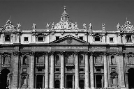
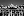
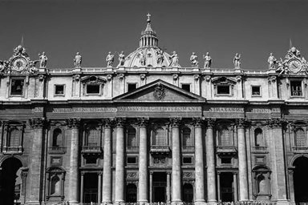
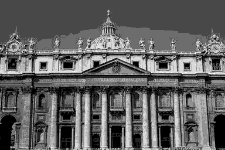
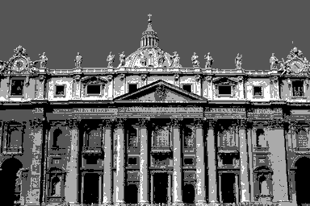
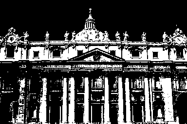

# DIP Homework 1: Fundamentals
## 戴旋, 13331043

## 1 练习

### 1.1 存储

1. How many bit planes are there for this image?
    * $log_2^{256} = 8\ bit\ planes$

2. Which plane is the most visually significant one?
    * Plane 8, 因为它包含了所有图像中像素的最高位的比特

3. How many bytes are required for storing this image? (Don’t consider image headers and compression.)
    * $2048\*2048\*8\ bits = 2^{22}\ bits$

### 1.2 相邻

1. p与q之间没有4-path，因为 $N_{4} q = \emptyset$

2. p与q之间存在一条长度为4的最短路径，$(3,0) \to (2,1) \to (2,2) \to (2,3) \to (1,4)$

3. p与q之间存在一条长度为5的最短路径 $(3,0) \to (2,0) \to (2,1) \to (2,2) \to (2,3) \to (1,4)$

### 1.3 逻辑操作

1. $A \cap B \cap C$
2. $(A \cap B) \cup (A \cap C) \cup (B \cap C)$
3. $(\overline{A} \cap B \cap \overline{C}) \cup (A \cap \overline{B} \cap C)$ 

## 2 编程

### 2.1 缩放

#### 2.1.1 分析

缩放操作的实现方式非常多，主流是采用内插值（interpolation）算法，该算法其中又有诸多分类，最常见的有最邻近内插值算法（Nearest Neighbor Interpolation）、双线性内插值（bilinear interpolation)、双三次插值（bicubic interpolation)。我在代码中实现了前两种，第三种使用了scipy提供的函数`interpolate.RectBivariateSpline`。

#### 2.1.2 算法

这里给出双线性内插值算法的伪代码：

```algorithm
function scale(input_img, size) return output_img
  create output_img with size
  
  width_ratio <- input_img.width / output_img.width
  height_ratio <- input_img.height / output_img.height

  for each pixel(x,y) in output_img
    in_x, in_y <- x * width_ratio, y * height_ratio
    i, j <- floor(in_x), floor(in_y) 
    u, v <- in_x - floor(in_x), in_y - floor(in_y)

    new_pixel <- (1-u)(1-v)*in_pixel(i,j) + (1-u)v*in_pixel(i, j+1) 
                + u(1-v)*in_pixel(i+1, j) + uv*in_pixel(i+1,j+1)
    
    put new_pixel to output_img
  end
```

#### 2.1.3 结果

结果是由双三次插值算法得到的。

<center>

<p>最初的图像</p>

<p>Scaling to 192x128</p>

<p>Scaling to 96x64</p>

<p>Scaling to 48x32</p>

<p>Scaling to 24x16</p>

<p>Scaling to 12x8</p>

<p>Scaling to 300x200</p>

<p>Scaling to 450x300</p>

<p>Scaling to 500x200</p>
</center>

### 2.2 量化

#### 2.2.1 分析
对灰度图像来说，量化非常简单。对每个新的灰度级别建立一个新的调色板（palette），然后根据原图每个像素的灰度值在调色板中找到最接近的那个，然后放到新的图片中即可。

#### 2.2.2 算法

```algorithm
function quantize(input_img, level) return output_img
  create output_img with size of input_img

  palette = 255 * x / (level - 1) for each x in [0, 1, .., 255]

  for each pixel in input_img
    new_pixel <- the nearest pixel from current pixel in new palette
    put new_pixel to output_img
  end
```

#### 2.2.3 结果

<center>

<p>最初的图像</p>

<p>128 gray levels</p>

<p>32 gray levels</p>

<p>8 gray levels</p>

<p>4 gray levels</p>

<p>2 gray levels</p>
</center>
