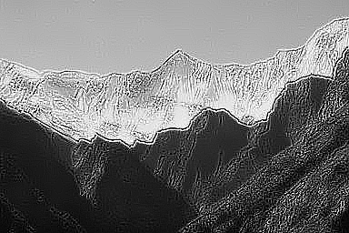

# DIP Homework 2: Histogram and Spatial Filtering
## 戴旋, 13331043

## 1 练习

### 1.1 直方图均衡化

设$MN$为像素的总数，$n_{i}$为原图强度值为$i$的像素个数，$L$为图像的强度级别。首先我们已知直方图均衡化的转换函数为：
$$ s_k =\frac{L-1}{MN} \sum_{i = 0}^{i_k}n_i $$
因为$s_k$是单调递增的函数，所以有$n_{s_k} = n_{r_k}$。第二次直方图均衡化产生：
$$ c_k =\frac{L-1}{MN} \sum_{i = 0}^{i_k}s_i = s_k$$
因此我们可以得出第二次直方图均衡化产生的结果与一次完全一样的结论。

### 1.2 空间滤波

1. 结果：$$\left[ \begin{array}{ccc}
  -177 & -420 & -279 & -271 \newline
  -74 & -72 & -90 & 52 \newline
  61 & 131 & 2 & 19 \newline
  172 & 199 & 215 & 60 \end{array} \right]$$

2. 正值代表该点上方比下方更亮，负值代表上方比下方更暗。

3. 检测水平方向的边缘。

## 2 编程

### 2.1 直方图均衡化

#### 2.1.1 结果

<center>
  
  初始图像
  
  初始图像的直方图
  
  直方图均衡化后的图像
  
  直方图均衡化后的图像的直方图
</center>

#### 2.1.2 分析

初始图像较暗，经过直方图均衡化后，图像稍微亮了一点。图中的天空变白了，山也变亮了，对比度相对增强了。从直方图来看，我们明显看到直方图均衡化后的图像的像素强度分布比初始图像更均匀了，除了少部分极端的值例外（体现在图中的雪山，好像没什么变化）。

#### 2.1.3 算法

```algorithm
function equalize_hist(input_img) returns output_img
  width, height <- input_img.size
  colors <- get the number of pixels with every intensity level from (0, 255)
  s <- empty

  for each level in [0, 256) do
    cdf[level] <- colors[0] + ... + colors[level]
    s[level] <- (cdf[level] / (width*height)) * 255
  end for

  for each pixel in input_img do
    p <- pixel intensity level
    Put s[p] to output_img
  end for

  return output_img
end
```

### 2.2 空间滤波

#### 2.2.1 结果

<center>

平滑滤波（3 X 3）

平滑滤波（7 X 7）

平滑滤波（11 X 11）

拉普拉斯算子滤波（3 X 3）

高增强滤波（k = 2.5）
</center>

#### 2.2.2 拉普拉斯算子滤波为什么能用来锐化图像？

对图像进行拉普拉斯算子滤波其实是在对每个像素求二阶导。以拉普拉斯算子离散化的一个模板为例（见下），从这个滤波器我们可以看出它能找到该点与周围的点的亮度差距。如果它在暗的地方很亮，它就会变得更亮。因为图像中的边缘就是那些灰度发生跳变的区域，所以拉普拉斯锐化模板在边缘检测中很有用。

$$\left[ \begin{array}{ccc}
  1 & 1 & 1 \newline
  1 & -8 & 1 \newline
  1 & 1 & 1 \end{array} \right]$$

拉普拉斯算子却可用二次微分正峰和负峰之间的过零点来确定，对孤立点或端点更为敏感，因此特别适用于以突出图像中的孤立点、孤立线或线端点为目的的场合。

#### 2.2.3 算法

```algorithm
function filter2d(input_img, filter) returns output_img
  input: filter must be an ndarray (numpy)

  width, height <- input_img.size
  m, n <- len(filter), len(filter[0]) // m row n col
  padding_x, padding_y <- floor(m/2), floor(n/2)

  for each pixel in input_img do
    x, y <- coordinate of pixel
    template <- matrix m x n, all filled with getpixel(x,y)
    for i in [x - padding_x, x + padding_x + 1] do
      for j in [y - padding_y, y + padding_y + 1] do
        template[i-x+padding_x][j-y+padding_y] = getpixel(i,j)
      end for
    end for
    new_pixel <- template * filter
    // sum all the products of each corresponding entry in two matrices
  end for

  for each pixel in output_img do
    put new_pixel to output_img
  end for
end
```