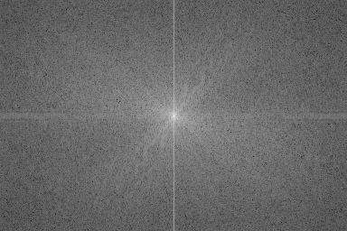
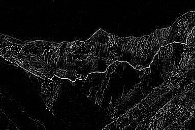
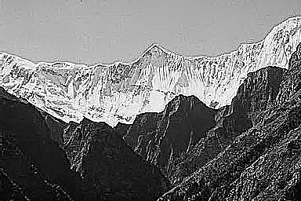
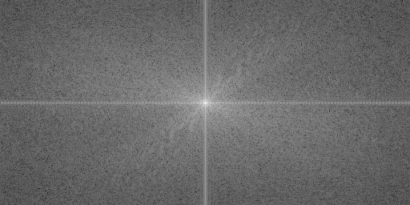
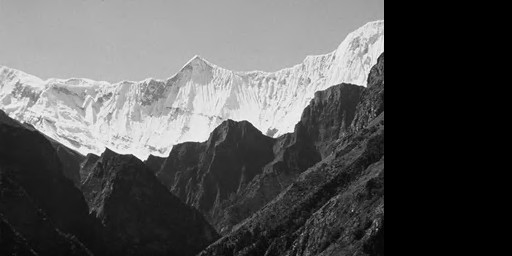

# DIP Homework 3: 
## 戴旋, 13331043

## 1 练习

### 1.1 旋转

傅里叶变换的共轭满足$F(u,v) = F^{\*}(-u,-v)$。故有以下式子成立：

$$\begin{align\*}
  \mathfrak{F}^{-1}\[F^{\*}(u,v)\] & = \sum_{u=0}^{M-1}\sum_{v=0}^{N-1}F(-u, -v)e^{j2\pi(-ux/M-vy/N)}\\\\
  & = \sum_{u=0}^{M-1}\sum_{v=0}^{N-1}F(-u, -v)e^{j2\pi(u(-x)/M+v(-y)/N)} \\\\
  & = f(-x, -y)
\end{align\*}$$

f(x,y)经过傅里叶变换变成了f(-x,-y)，即相当于绕中心旋转了180°，产生了Fig.1(b)的效果。

### 1.2 傅里叶频谱

原图中，边缘相对偏白，像素值偏大。在给周围填充了像素值为0的一系列点之后，其原来的边缘处会产生差距很大的转变，而不是平滑过渡。这些巨大的转变体现在频率域中的水平方向与垂直方向的高频部分。因此频谱图中沿着水平轴与竖直轴的的信号长度有了很大的提升。

### 1.3 低通与高通

1. 如下。

$$\begin{align\*}
  f(x)\ast g(x) & = f(x-1,y-1) + 2f(x,y-1) + f(x+1,y-1) - f(x-1,y+1) - 2f(x,y+1) - f(x+1,y+1)
\end{align\*}$$
傅里叶变换：
$$\begin{align\*}
  G(u,v) & = \mathfrak{F}\[g(x,y)\] \\\\
  & = (e^{j2\pi(-u/M-v/N)} + 2e^{-j2\pi v/N} + e^{j2\pi(u/M-v/N)} \\\\ 
  & - e^{j2\pi(-u/M+v/N)} - 2e^{j2\pi v/N} - e^{j2\pi(u/M+v/N)})F(u,v) \\\\
  & = H(u,v)F(u,v) \\\\
  H(u,v) & = e^{j2\pi(-u/M-v/N)} + 2e^{-j2\pi v/N} + e^{j2\pi(u/M-v/N)} \\\\ 
  & - e^{j2\pi(-u/M+v/N)} - 2e^{j2\pi v/N} - e^{j2\pi(u/M+v/N)} \\\\
  & = -2jsin\[2\pi(u/M+v/N)\] - 4jsin(2\pi v/N) - 2jsin\[2\pi(-u/M+v/N)\] \\\\
  & = -4j(sin2\pi(v/N)(1 + cos2\pi (u/M)))
\end{align\*}$$

所以频率域对应的滤波器H(u,v)为：
$$-2j\lbrace sin\[2\pi(u/M+v/N)\] + 2sin(2\pi v/N) + sin\[2\pi(-u/M+v/N)\]\rbrace$$
2. 高通滤波器。因为H(0,0)为0，即直流成分为0。随着x,y逐渐增大，H(x,y)也逐渐变大...所以是高通滤波器。

### 1.4 可交换性

直方图均衡化就相当于对每个像素做了个变换。
$$
filter\ then\ equal = \sum_{x=0}^{M-1}\sum_{y=0}^{N-1}(f(x,y)g(x-m,y-n)) * s(x,y) \\\\
equal\ then\ filter = \sum_{x=0}^{M-1}\sum_{y=0}^{N-1}(f(x,y)*s'(x,y)) * g(x-m, y-n)
$$

问题关键就在于前后的直方图均衡化的变换s与s'是否一致。s与像素值出现的频率有关，给出的高频率加强滤波只是增大了某些像素的大小，同等加大的情况下是不会影响s的。所以即使反序，结果也是一样的。

## 2 编程

### 2.1 傅里叶变换

#### 2.1.1 结果

<center>
  
  傅里叶谱
  
  两次DFT
</center>

#### 2.1.2 分析

离散傅里叶变换可以抽象为矩阵的乘法。所以图像的傅里叶变换$F(u, v)$可以表示成
  $$ F(u,v) = W_{M}^{ux}\*f(x,y)\*W_{N}^{vy} $$
其中 $ W_{N}^{ux} = e^{-j2\pi(ux/N)} $，是一个 N x N 的矩阵，逆变换只需去掉$e$的指数的负号即可。因为傅里叶变换的原始结果相对复杂，为了得到它的谱，我们首先对其做中心化处理，然后再将其标定到指定的范围内。即可得到傅里叶变换的谱。  
傅里叶变换是可逆的，所以通过正变换与负变换可以得到原来的图像。

#### 2.1.3 算法

```algorithm
function dft2d(input_img, flags) returns an 2d-matrix
  if input_img is an Image object
    data <- transform input_img to an 2d-matrix and get pixel matrix
  else if input_img is an 2d-matrix
    data <- input_img's pixel matrix
  else
    return
  end if

  if flags is 1
    result <- dft(data)
  else if flags is 2
    result <- idft(data)
  end if
  
  return result

function dft(data) returns an 2d-matrix
  M, N <- data's height and width
  left <- get an fourier transform matrix of size M
  right <- get an fourier transform matrix of size N

  return left * data * right // an 2d M x N matrix

function idft(data) returns an 2d-matrix
  M, N <- data's height and width
  left <- get an inverse fourier transform matrix of size M
  right <- get an inverse fourier transform matrix of size N

  return left * data * right // an 2d M x N matrix

// Helper to centralize and scale the fourier transform's result
function shift(data) returns an centralized 2d-matrix
  M, N <- data's height and width
  swap the [0, M/2) and [M/2, M] part for whole matrix
  swap the [0, N/2) and [N/2, N] part for whole matrix
  return swapped matrix

function scaling(data, L defaults to 256) returns an scaled matrix
  pos <- data - min(data) for every element
  result <- (L-1) * (pos / max(data)) for every element
  return unsigned int result
```

### 2.2 频率域滤波

#### 2.2.1 结果

<center>
  
  7X7 平滑滤波
  
  拉普拉斯滤波
  
  原图+拉普拉斯
</center>

#### 2.2.2 分析

1. 根据卷积定理我们知道空间域的滤波与频率域的滤波存在对应关系。空间域滤波器与图像的卷积等于频率域的滤波器与图像的乘法。频率域滤波就从这儿入手。

2. 为了在频率域他们能做乘法（不是矩阵乘法而是点乘），我们需要将他们扩张成一定的大小。对于大小为MxN的图像与m x n的滤波器来说，图像与滤波器至少要扩张到M+m-1 x N+n-1才行，然后把他们都放在新的矩阵的左上角，其它部分为零。然后对他们做分别做傅里叶变换，再对他们乘法的结果做傅里叶反变换，即可得到滤过波的图像。

3. 但仅仅这样会导致图像四周会变黑，在空间域滤波我们也遇到过这种状况。为了避免这种情况，在扩充图像矩阵前，先把图像扩充到2m+M-1x2n+N-1，用边缘值来填充。之后再分别把滤波器与图像扩充到3m+Mx3n+N。

#### 2.2.3 算法

```algorithm
function filter2d_freq(input_img, filter) returns an 2-d matrix
  data <- get input_img's pixel matrix
  M, N <- data's height and width
  m, n <- filter's height and width

  padded <- padding data use edge value to M+2m x N+2n
  p, Q <- M + 2m + m -1, N + 2n + n - 1

  f <- padding 0 to padded's right and bottom to P x Q
  h <- padding 0 to filter's right and bottom to P x Q

  F <- dft(F), H <- dft(H)

  product <- the real part of idft(F * H)
  result <- the m->m+M, and n->n+N part of product (MxN matrix)

  return result
```

### 2.3 Bonus：快速傅里叶变换

#### 2.3.1 结果

<center>
  
  傅里叶谱
  
  两次FFT(黑色部分，因为补了0)
</center>

#### 2.3.2 分析

快速傅里叶变换其实是个分而治之的方法。通过不断地把问题分为一半来达到时间复杂度的剧烈下降。实现起来也非常简单，通过递归即可完成...

#### 2.3.3 算法

```algorithm
function fft2d(input_img, flags) returns an 2d-matrix
  data <- get input_img's pixel matrix
  M, N <- data's height and width
  
  // pad the data to pow of 2, because fft only supports that. 
  new_M, new_N <- ceil(log2(M,N))^2
  padded <- pad 0 to data's right and bottom to new_M x new_N

  fft_row <- fft1d(row, flags) for every row in data
  result <- fft1d(col, flags) for every column in data
  
  return result

function fft1d(data, flags) returns the result of fft
  N <- length of data

  if N <= 32:
    return dft(data, 1)
  else
    even <- fft1d(even index elements' collection, flags)
    odd <- fft1d(odd index elements' collection, flags)

    // flags -1 means inverse
    factor <- 1d fourier matrix according to flags of size N

    // ++ means concatenate
    result <- even + odd * factor's former half ++ 
              even + odd * factor's latter half

    return result
```
