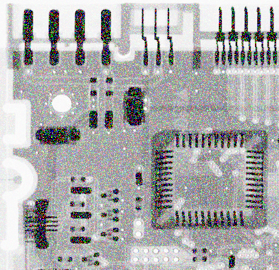
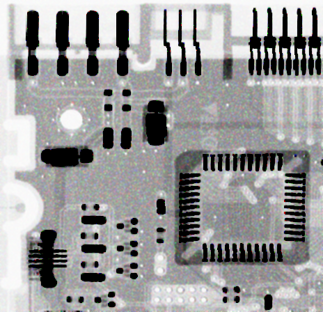
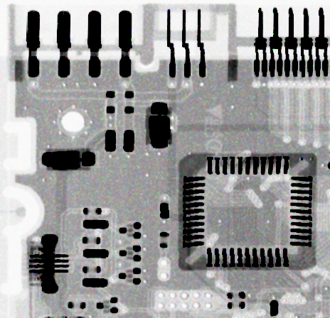
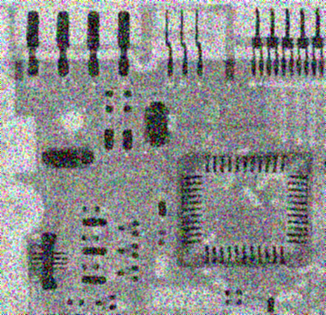
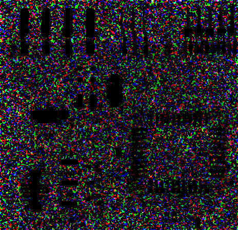
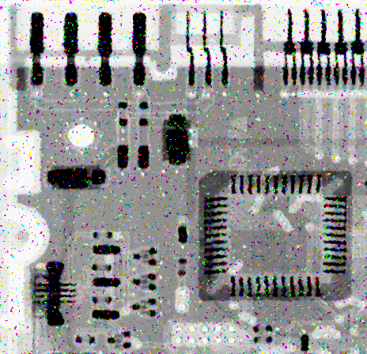
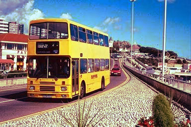

# DIP Homework 4: Image Restoration and Color Image Processing1
## 戴旋, 13331043

## 1 Exercises

### 1.1 Color Spaces

1. HSI 模型优于 RGB 模型：对 HSI 模型来说，在进行空间域滤波的时候，我们可以单独对 Intensity 分量滤波。而对于 RGB 模型，需要分别对 RGB 三个分量进行滤波再整合。从这点上看 HSI 模型优于 RGB 模型。  
RGB 模型优于 HSI 模型：噪声对于 HSI 分量的影响很大，去噪很困难。而对于 RGB 分量，影响小得多，去噪处理也方便。

2. 如果 $ H \in [270, 360) $ 或 $ H \in [0, 60) $，给 H 加了 $ 60^{\circ} $ 后，颜色在 RG 扇形内。根据公式：
$$\begin{align\*}
B & = I(1 - S) \\\\
R & = I[1 + \frac{Scos(H + 60^{\circ})}{cosH}] \\\\
G & = 3I - (R + B)
\end{align\*}$$
如果 $ H \in [60, 180) $，给 H 加了 $ 60^{\circ} $ 后，颜色在 GB 扇形内。根据公式：
$$\begin{align\*}
R & = I(1 - S) \\\\
G & = I\[1 + \frac{Scos(H + 60^{\circ})}{cosH}\] \\\\
B & = 3I - (R + G)
\end{align\*}$$
如果 $ H \in [180, 270) $，给 H 加了 $ 60^{\circ} $ 后，颜色在 BR 扇形内。根据公式：
$$\begin{align\*}
G & = I(1 - S) \\\\
B & = I\[1 + \frac{Scos(H + 60^{\circ})}{cosH}\] \\\\
R & = 3I - (G + B)
\end{align\*}$$

### 1,2 Color composition

<svg xmlns="http://www.w3.org/2000/svg" viewBox="0 0 110 110" width="220" height="220"><line x1="10" y1="0" x2="10" y2="110" stroke="black"></line><line x1="0" y1="100" x2="110" y2="100" stroke="black"></line><polygon points="20,90 40,5 95,70" fill="white" stroke="black"></polygon><circle cx="50" cy="50" r="1" stroke-width="0" fill="black"></circle><line x1="50" y1="50" x2="57" y2="80" stroke="black" stroke-dasharray="1,1"></line><text x="20" y="95" font-size="8px" font-style="italic">c1(x1,y1)</text><text x="50" y="10" font-size="8px" font-style="italic">c2(x2,y2)</text><text x="75" y="85" font-size="8px" font-style="italic">c3(x3,y3)</text><text x="50" y="60" font-size="8px" font-style="italic">c0(x0,y0)</text><text x="55" y="90" font-size="8px" font-style="italic">d(a,b)</text></svg>

设 $c_0(x_0,y_0)$为 $c_1,c_2,c_3$ 围成的三角形中的任意一点（一种颜色），作 $c_{0}d \perp c_1c_3$ 交 $c_1c_3$ 于 $d(a,b)$， 如上图所示。  
$p_1,p_2,p_3$ 为 $c_0$ 中 $c_1,c_2,c_3$ 的百分比，设  
$$dis(p_a,p_b)=\sqrt{(x_a-x_b)^2 + (y_a-y_b)^2}$$  
有：
$$\begin{align\*}
p_1 & = \frac{dis(c_1, c_3) - dis(d,c_3)}{dis(c_1,c_3)} \\\\
p_3 & = \frac{dis(c_1, c_3) - dis(d,c_1)}{dis(c_1,c_3)} \\\\
100 & = p_1 + p_2 + p_3
\end{align\*}$$
通过上式即能得出组成给定颜色 $c_0$ 中 $c_1,c_2,c_3$ 的百分比 $p_1,p_2,p_3$。

## 2 Programming Tasks

### 2.1 Image Filtering

#### 2.1.1 Atrithmetic Mean Filter

  
  Arithmetic Mean Filter (3 x 3)
  
  Arithmetic Mean Filter (9 x 9)

白色区域的宽度与高度相对于原图都变小了，颜色也相对变暗了些。整张图片也产生模糊的效果。这是由于算术均值滤波器取的是范围内的均值，于是产生了所示的效果。

#### 2.1.2 Harmonic Mean Filter

  
  Harmonic Mean Filter (3 x 3)
  
  Harmonic Mean Filter (9 x 9)

3 X 3 的调合均值滤波器使白色区域宽度与高度都相对于原来的一半，颜色保持不变。  
而 9 X 9 的调合均值滤波器产生的结果一片漆黑。根据调合均值滤波的公式，如下:  
$$ \hat{f}(x,y) = \frac{mn}{\sum_{(s,t) \in S_{xy}}\frac{1}{g(s, t)}} $$
一旦有一个 $g(s,t)$ 的值为零，$\hat{f}(x,y)$ 就无限趋于 0，也就使得原图变为黑色。

#### 2.1.3 Contra Harmonic Mean Filter

  
  Contra Harmonic Filter (3 x 3 Q: 1.5)
  
  Contra Harmonic Filter (9 x 9 Q: 1.5)

反调和均值滤波器的结果与均值滤波器基本。根据反调和均值滤波的公式，如下：  
$$ \hat{f}(x,y) = \frac{\sum_{(s,t) \in S_{xy}} g(s,t)^{Q+1}}{\sum_{(s,t) \in S_{xy}} g(s,t)^{Q}} $$
当 Q 为负值时，其基本相当于调和均值滤波器。变黑的原理也是与调和均值滤波器一样。

### 2.2 Image Denoising

#### 2.2.0 Notice

文件中给的图不是灰度图，而是 RGBA 色彩空间的。在编码中对 RGB 或 RGBA 色彩空间的图像，我的处理方式是按分量单独处理，而不是按向量同步处理，这也导致彩色噪声的产生。请注意这一点。

#### 2.2.1 Gauss Noise Generator and Salt and Pepper Noise Generator

  
  Gauss Noise (Mean: 0, Standard Variance: 40)
  
  Salt Noise (Probability: 0.2)
  
  Salt And Pepper Noise (Probability for Salt and Pepper: 0.2)

高斯噪声与椒盐噪声的结果如上所示。高斯噪声采用 Box-Muller 方法生成。下面是算法：

#### 2.2.2 Denoising Gauss Noise

  
  Gauss Denoise: Arithmetic Mean Filter (3 x 3)
  
  Gauss Denoise: Geometric Mean Filter (3 x 3)
  
  Gauss Denoise: Median Filter (3 x 3)

三者皆一定程度上消除了高斯噪声。  
算术均值滤波与中值滤波结果相似，图像略微模糊，噪声也没完全消除，但能基本还原图像。  
几何均值滤波消除噪声的能力与上面基本一致，但图像模糊程度很低，黑色部分相对原图变粗了，而且图中出现一些很大的点（因为是彩色图像，所以不止有黑色）。因为几何均值滤波是在做乘法，一旦周围有一个像素值为0的点，其滤波结果就是0，产生了黑色。再与其他分量组合，产生了别的颜色。

#### 2.2.3 Denoising Salt Noise

  
  Salt Noise: Harmonic Filter (3 x 3)
  
  Salt Noise: Contra Harmonic Filter (3 x 3, 1.5)
  
  Salt Noise: Contra Harmonic Filter (3 x 3, -1.5)

处理盐噪声时，调和中值滤波与反调和中值滤波（-1.5）的效果几乎除去了所有噪声！而反调和中值滤波（1.5）的结果惨不忍睹，黑色区域变白，其他区域也基本变白，完全没有去噪的效果，反而毁了这张图。  
前面提到过，调和中值滤波与反调和中值滤波（负Q）的效果类似。由于公式的特殊性，对于分母的组成部分$\frac{1}{g(s, t)}$来说，像素值越大，其值越小；像素值越小，其值越大。这也就导致了它能过滤掉盐噪声而加重椒噪声的影响。  
同样的道理，反调和中值滤波（正Q）的作用正好相反，它能过滤掉椒噪声而加重盐噪声的影响。这也造成了滤波结果的“白化”。

#### 2.2.4 Denoising Salt and Pepper Noise

  
  Salt And Pepper Denoise: Arithmetic Mean Filter (3 x 3)
  
  Salt And Pepper Denoise: Geometric Mean Filter (3 x 3)
  
  Salt And Pepper Denoise: Max Filter (3 x 3)
  
  Salt And Pepper Denoise: Min Filter (3 x 3)
  
  Salt And Pepper Denoise: Median Filter (3 x 3)

处理椒盐噪声并存的情况时，算术均值滤波与中值滤波能达到去噪的效果。  
其中，中值滤波近乎去除了所有的噪声，除了零星残留的椒盐噪声，但图像基本复原，效果十分好。因为椒盐噪声属于两个极端，取中值几乎完全忽略了他们的影响。除了少部分邻域内所有都变成椒或者盐的部分，也就是图中零星残留的那些点。  
而算术均值滤波虽然能去除椒盐噪声，但图像十分模糊，效果也一般。因为算术均值滤波并没有忽略椒盐噪声，而只是一定程度上降低了他们的影响，所以图像模糊，效果不怎么优秀。  
最大值滤波，最小值滤波与几何均值滤波的结果都很糟糕，破坏了图片。  
最小值滤波与几何均值滤波的结果几乎一致。对于最小值滤波，一旦邻域内有0，就取了0。而几何均值滤波遇到0，也无视邻域其它点，取了0。所以这导致它们完全保留了椒噪声，图片黑化。  
最大值滤波则完全保留了盐噪声，图片白化。  

### 2.3 Histogram Equalization On Color Image

#### 2.3.1 Result

  
  Histogram Equalization Seperately
  
  Histogram Equalization Together

#### 2.3.2 Discussion

分别对不同分量进行直方图均衡化再合并的结果的对比度与饱和度相对原图都增大了，有一种老旧的感觉。分别对不同分量处理，这导致不同分量的像素值的改变都是各行其道，与原本的颜色的差异相对会更大，导致图片的不协调。  

而对合并不同分量处理的结果看上去相对更符合审美一些。因为是整体的直方图均衡都，不同分量的相同像素值改变都是一样的，在提升图片质量的同时，不会与原本的颜色产生较大差别。
